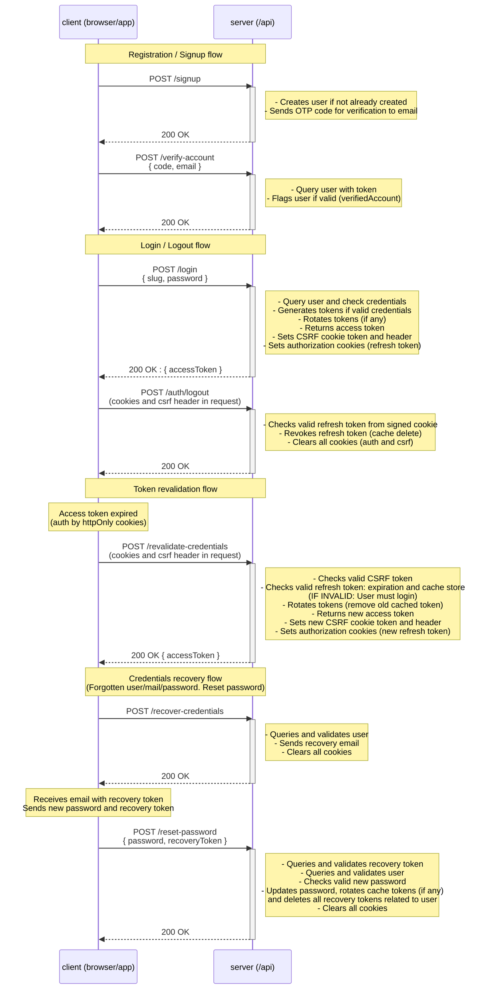

# NestJS Auth bootstrap template as microservice

Speed up your development and your time to market with a transparent and enhanced JWT authentication solution.

<!-- ([Check it in action here]())  upload video-->

### Index

1. [Why?](https://github.com/mmiglioranza22/nestjs-auth-bootstrap/blob/main/README.md#why)
2. [Why this?](https://github.com/mmiglioranza22/nestjs-auth-bootstrap/blob/main/README.md#why-this)
3. [Who is this for?](https://github.com/mmiglioranza22/nestjs-auth-bootstrap/blob/main/README.md#who-is-this-for)
4. [What can you do with this?](https://github.com/mmiglioranza22/nestjs-auth-bootstrap/blob/main/README.md#what-can-you-do-with-this)
5. [What's included?](https://github.com/mmiglioranza22/nestjs-auth-bootstrap/blob/main/README.md#whats-included)
6. [Why JWT?](https://github.com/mmiglioranza22/nestjs-auth-bootstrap/blob/main/README.md#why-jwt)
7. [Development](https://github.com/mmiglioranza22/nestjs-auth-bootstrap/blob/main/README.md#development)
8. [Testing](https://github.com/mmiglioranza22/nestjs-auth-bootstrap/blob/main/README.md#testing)
9. [Auth cycle](https://github.com/mmiglioranza22/nestjs-auth-bootstrap/blob/main/README.md#auth-cycle)
10. [A note on user roles (specific to this template)](https://github.com/mmiglioranza22/nestjs-auth-bootstrap/blob/main/README.md#a-note-on-user-roles)

## Why?

**To save you time from the chores and setup most projects must undergo.**

Basic setup and configuration for features like authentication, authorization, forgot password/user/email, user roles, sign up, login, seeding (for fast development), containerization, CI pipelines, mailing, unit and integration testing, database setup and overall configuration (plus all the custom guards, decorators, filters, documentation) can easily stall your momentum costing you time (and money) you can't or shouldn't waste if you aim to ship as soon as possible.

Our estimate for all the above amount a total of 90+ hours saved (even more by [other estimates](https://bcboilerplates.com/)). _And we are not even counting all the debugging and manual fixing time you would likely spend while trying to set it up yourself (Throw in an extra 24 hours if you are super confident)_

<br>

\*\*\*\*\* _That's **11 days** plus **an extra 3 days only debugging**._ _(assuming an 8-hour work day)_ \*\*\*\*\*

<br>

You could also try generating all with AI and spend at least half that time (fingers crossed 🤞) just trying to understand how the model designed the system and whether it actually does what you asked for. Then add a couple more days you will certainly spend **refactoring** the mess it will likely made. Top it all with a couple more days spent double checking that all tests are actually testing what you need (Plus manual Postman testing, if you are serious about how robust you want your project to be). AI-driven solution lands in a similar time estimate: **10 to 14 days**, give or take 1 day.

**But you can save all that time and spend it on developing the features your customers need**.

Of course, you will spend time reading the code and making a sense out of it the first time (which really can't be measured as that depends exclusively on your available time and experience with this kind of setups). But in the end, you will have a working and tested solution you **comprehend** and **own**.

We are confident the code is clear (comments help a lot, same as tests) and in case of unsolvable doubt you can always open an issue asking for clarifications. We are glad to help!

# Why this?

There are already great solutions like the one provided by brocoders [nesjt-boilerplate](https://github.com/brocoders/nestjs-boilerplate/tree/main) (you should definitly check it out) which can feel overwhelming at first by the sheer amount of features and options you have to choose from.

That is why this template keeps it simple: **you get what you see** while always **being able to change anything you need to** (See [What's included](https://github.com/mmiglioranza22/nestjs-auth-bootstrap/blob/main/README.md#whats-included))

You can roll your own auth and develop everything from scratch (which I certainly encourage you to do if you are learning to use an awesome tool like NestJS), with all the time and pain that involves (which is totally worth it, yet maybe not for someone that needs an auth solution with urgency or does not want to think twice about it).

You can delegate authentication to battle-tested solutions with third-party packages. You trust them to do all the heavy lifting for you and take advantage of the free plans while they last (or start paying from the start), and you are willing to spend the time it will take to understand the docs (a learning curve that not everybody wants to go through).

Or you can try this template if you just want to see the code and be able to tinker with it without paying a dime while always having the control over your own auth flow.

No subscription, no pricing. Just the code.

#### How this came to be:

This was developed during a larger project and it seemed to be a monster of its own. By removing the business specific logic from that project, we end up with something we thought could be useful for anybody struggling with authentication and authorization in NestJS applications, or just wanted something that works out of the box.

## Who is this for?

1. You are developing a backend application with NestJS for any kind of project. You finally need to manage authorization and authentication, you don't have a clue how to do so or you don't have a preferred solution to that problem, might as well try one already implemented and tested.

2. You just want something to work out of the box and don't mind adjusting some configs ([explained below](https://github.com/mmiglioranza22/nestjs-auth-bootstrap/tree/main?tab=readme-ov-file#requirements)). You also want the freedom to expand what's usefull and discard what you don't need for your particular project. You will use this as a skeleton for your custom authentication strategy: sessions, api keys, choose your pick.

3. You want a solution you can test fast and ship faster without third-party solutions. You want to keep control over everything (token cache store, user roles, credentials recovery, account verification, etc) while still being able to customize it to your needs.

4. Security is paramount to your application and you need a scalable and performant solution that will not become a bottleneck in the future. You likely work with more than one application in your system, or you know for a fact that the system you are or will be developing is of a distributed nature.

5. Your application uses REST _(you could adapt it to your need, but know quite a lot of refactor will be needed)_.

6. You are developing a frontend for an authentication flow and need a backend ready with clear API endpoints.

## What can you do with this?

Whatever you want.

You can use it as is, develop your own authentication strategy and replace the one provided, extend it and implement your own token reuse detection solution (to enable multiple device login for example or blacklist used access token), remove any module you do not use and modify what you need, check how tests are setup and configured for NestJS (not a particularly trivial endeavour), add observability and monitoring to see how it scales, convert it into your own auth micro service, use it as a backend authentication server solution so you can integrate your frontend project, play around trying to crack it and find vulnerabilities unknown until now _(you can submit them if you find one!)_

License is MIT

## What's included?

- Nest application configured for fast builds and testing (`swc`).
  <br>
- Basic `User` and `Role` entities (**TypeORM** implementation)
  <br>
- **JWT** based authentication strategy implemented:
  <br>
  - `accessToken` in response body for client manipulation
    <br>
  - `Authorization` cookie with refresh token (`HttpOnly`, `SameSite`, `Secure`, `Signed`)
    <br>
- Signed Double [CSRF](https://github.com/pillarjs/understanding-csrf) Cookie pattern implementation:
  <br>
  - `x-csrf-token` header and `__Host-csrf` cookie token
    <br>
- Cache store for token rotation (**Redis** implementation)
  <br>
- Docker compose files to work with your development and test environments
  <br>
- Unit and integration testing (Vitest + [Testcontainers](https://testcontainers.com/)) (Optional docker compose tests too if you don't want to use Testcontainers)
  <br>
- Basic mail service (`nodemailer` solution with `mailtrap`. You can configure it or change it completely for your provider of choice)
  <br>
- Swagger docs (`/api/swagger`)
  <br>
- Basic **`Throttler`** module (mainly useful for production environment. Configure it for your use case)
  <br>
- Basic **`ClsModule`** module (for [request identification](https://papooch.github.io/nestjs-cls/features-and-use-cases/request-id), should you want to monitor specific requests or share context easily)
  <br>
- `LoggerModule` with [`nestjs-pino`](https://github.com/iamolegga/nestjs-pino). (Optional: change log level at runtime)
  <br>
- [Postman collection](https://www.postman.com/orbital-module-astronomer-66959558/nestjs-auth-bootstrap/collection/16327695-aa18b690-8419-4a22-a824-81af4fae7c19) for faster development and manual testing (environment and pre/post scripts configured)
  <br>
- **Seed service** for fast development setup anc checking out how it works (best use with provided Postman collection)
  <br>
- Main workflow pipeline for Github Actions (linting, build and tests), extensible for deploys.
  <br>
- Tons of comments that explain how things work if you get lost and cite resources used for developed implementations and solutions (You don't get that with other templates...)
  <br>

Least but most important, **the ability to modify any of the above to fit your specific needs**.

That said, the template `CORS` configuration might not be the one you need **and it is up to you to configure it (just passing the options you want)**

Here's a view of how the project is organized:

```
- /config (env files)
- /src
   |_ app.module.ts
   |_ main.ts
   |_ /seed
   |_ /common
   |   |_ /constants
   |   |_ /decorators
   |   |_ /dtos
   |   |_ /filters
   |
   |_ /infra
   |   |_ /cache
   |   |_ /database
   |   |_ /logging
   |   |_ /mail
   |
   |_ /resources
   |   |_ /auth
   |   |_ /shared
   |   |_ /user
   |
   |_ /swagger
   |_ /utils
- /test
   |   |_ /helpers
   |   |_ /integration


```

## Why [JWT](https://youtu.be/P2CPd9ynFLg?si=mKVvy1h3_ERcrF6W)?

Before any claim or objection is pointed out, know that like most things in programming, **all authentication solutions have their own tradeoffs and usecases**.

There are no silver bullets, just less worse solutions which can be improved significantly when their common pitfalls are addressed (which this template attempts to do).

You will come across several resources and opinions that state that JWT is far too complicated for simple MVPs or POCs when deciding how to solve authentication, or that is not inteded at all for authentication. And partly those opinions are true because getting it right is not a trivial matter and JWT are not ideal for all usecases. Centralized authentication solutions (like sessions) can be far better for other projects that do not talk with other applications, have low to moderate traffic, require instant access revocation, or any other reason that makes JWT not suitable.

Some sensible objections to JWT that were addressed in this project are:

1. _**JWT can't be revoked on logout**_:

This is the reason why JWT good practices encourage to make them short lived (minutes). And still, for a small time window those JWT will remain valid. **However**, this template ensures that once the user logouts, subsequent requests to protected routes (POST, PATCH, DELETE) will result in `Unauthorized` `401` responses.

The same thing is done should the user be revoked access while still being logged. This is achieved by keeping track of currently logged users in a cache store (like a session storage used for refresh tokens) and making all sensible routes `@Protected`. Read-only routes (GET) will still be accessible for the short lifetime of the access token (which you could just solve by changing `@Private` routes to `@Protected`).

Token rotation on login, logout, token revalidation, user deletion or specific user access revocation ensures all protected routes are inaccessible **immediately** and private routes only accesible for the remaining lifespan of the access token.

2. _**JWT are not safe as they can be read by anyone**_:

This is part of the specification for JWT and the reason why tokens in this template only send the minimal information required for the application to work properly without leaking anything related to **authorization** (user roles). Security for JWT transmission does not rely on encryption as no sensible claims should be sent to the client (you can expand this template's solution to use JWE if you need to share sensible claims in each token). Rather, JWT remain safe and secure as long as:

- they are signed with a strong secret that is stored securely
- use short expiration time
- are transmitted by `https` (which should be the default for any type of communication, not just JWTs)
- stored by the client in signed, secure `httpOnly` cookies (preventing Cross-Site Scripting)

The interface used for access tokens only use the `sub` property. Refresh tokens add an extra `check` property used check its respective hash which is stored in cache (You can make this validation process even faster by just storing and checking the plain `check` value)

<br>

```ts
export interface JwtPayload {
  sub: string;
  check?: string;
}
```

<br>

3. _**JWT are not suited for fine grain control**_:

Each project handles authorization differently (this template uses **role based** authorization without using JWT for that). Read the [second point](https://github.com/mmiglioranza22/nestjs-auth-bootstrap/edit/main/README.md#:~:text=66-,67,-68) listed above: JWT are used here for authentication (granting access based on who the user is), hence they remain slim and reveal no information whatsoever of which resources can be accessed or which permissions are granted to a specific user (Which might not be just the usecase for your project. Adapt accordingly)

4. _**Still JWT are not safe against CSRF threats, they are useless against them!**_:

These claims stem from not understanding the purpose of JWTs and is analog to stating that a screwdriver is useless for the purpose of hammering nails: it is just not the tool for that.

CSRF threats are addressed by CSRF specific solutions, which this template conveniently has by implementing the signed double submit CSRF pattern. This implementation was developed with AI and tested for common pitfalls (timing attacks for different token lengths) and is transparent for you to check it out, enhance or modify it completely. You can check how it was developed [here](https://github.com/mmiglioranza22/chatgptools/blob/fcaff05045a8751c65779681496577279be8bfc0/csrf_utils/README.md).

Not satisfied with the provided CSRF solution? You can reuse most components and implement [`csrf-csrf`](https://github.com/Psifi-Solutions/csrf-csrf) yourself

<br>

## Development

#### Requirements

- Docker (4.57.0)
- Node (22, 24.13.0)
- Volta (optional)

After cloning the repository, you should create an `.env.development` file with your own variables using the template provided in the `/config` directory (env file must be located in that directory unless you modify how you want docker compose to look for it)

```
pnpm i
docker compose -f docker-compose.dev.yaml up -d
pnpm run start:dev
```

or my favourite

```
docker compose -f docker-compose.dev.yaml down && docker compose -f docker-compose.dev.yaml up -d && pnpm run start:dev
```

Development server listens to `localhost:3000/api`. Swagger docs: `localhost:3000/api/swagger`

Open [Postman collection](https://www.postman.com/orbital-module-astronomer-66959558/nestjs-auth-bootstrap/collection/16327695-aa18b690-8419-4a22-a824-81af4fae7c19).

Hit `/api/seed` to populate and initialize entities. If response is `{ ok: true }`, then you are all set.

<br>

#### Mail service configuration

If you wish to use the implemented **mailtrap** solution, you must create your own account and configure environment variables `MAILTRAP_HOST, MAILTRAP_PORT, MAILTRAP_USER, MAILTRAP_PASSWORD`.
Refer to [mailtrap.io](https://mailtrap.io/) docs to set up your own configuration (sandbox tab)

<br>

#### Troubleshooting - Notice on first time running `postgres` containers

Postgres demands `POSTGRES_PASSWORD` variable to be set on the first time docker compose runs. Although this is done by TypeORM when initializing the application, the password variable at the time the container starts up is not available (It then readsF the variable from the `.env.development` file).

Docker needs to read these variables from an `.env` file on startup.

`.env` file is added in this repository for easy testing and development.

<br>

🚨🚨🚨🚨🚨🚨🚨🚨🚨🚨🚨🚨🚨🚨🚨🚨🚨🚨🚨🚨🚨🚨🚨🚨🚨🚨🚨🚨🚨🚨🚨🚨🚨🚨🚨🚨🚨🚨🚨🚨🚨🚨🚨🚨🚨🚨🚨🚨🚨🚨

<br>

🚨🚨 **If you eventually use your own variables, REMEMBER TO ADD `.env` TO YOUR `.gitignore` FILE.** 🚨🚨

<br>

🚨🚨🚨🚨🚨🚨🚨🚨🚨🚨🚨🚨🚨🚨🚨🚨🚨🚨🚨🚨🚨🚨🚨🚨🚨🚨🚨🚨🚨🚨🚨🚨🚨🚨🚨🚨🚨🚨🚨🚨🚨🚨🚨🚨🚨🚨🚨🚨🚨🚨

This is merely a development issue. For a production release, use the strategy that best suits your CI/CD to prevent using an `.env` file with secrets

<br>

## Testing

Requests logs are enabled by default for integration tests. Error logs are disabled by default (you can enable it by changing this condition [here](https://github.com/mmiglioranza22/nestjs-auth-bootstrap/blob/9c70227a4950a985caeff8b610362eefb50da107/src/common/filters/global-exception.filter.ts#L54))

Use `DEBUG=testcontainers*` if you want to check logs when using test containers

If you dont want to use Testcontainers for integration testing, you only need to remove all "Sanity check" tests and logic related to `TestContainersSetup` helper class, and then run:

```
docker compose -f docker-compose.test.yaml down && docker compose -f docker-compose.test.yaml up -d && npx vitest run int
```

<br>

## Auth cycle

The following explains how the authentication is set and configured for the template.

**You can modify any of these defaults to suit your own needs**.

JWT access token is used for stateless authentication.

JWT refresh token used for token revalidation with a specific `check` claim and sent in `httpOnly` `signed` `secure` `SameSite=strict` cookie.

Refresh token is stored in cache for token rotation and invalidation. Its key contains the user's id. Its value contains user information (id, roles and active status) and a hash to be checked against the `check` claim.

CSRF token is used as an extra layer of security, in a signed double submission pattern (`x-csrf-token` header and `__Host-csrf` cookie token). CSRF cookie is **not** `httpOnly` for easier client manipulation.

`/login`, `/auth/logout` and `/auth/revalidate-credentials` rotates cached tokens.

Accessing `private` routes relies only on valid access token. (`GET` only)
Accessing `protected` routes adds CSRF token validation plus user's status and role (`POST`, `PATCH`, `DELETE`)

Logout, user deletion and user access denial, as well as requests for password change (`/recover-credentials`, `/reset-password`) **all rotate tokens (refresh and csrf)**, forbidding access to **protected routes**, yet keeping access to private routes accessible for the lifetime of access token (short lived).

CSRF token is valid until access token expires, users logouts or any other situation where tokens get rotated.

<br>



<br>

## A note on user roles

This template relies on user roles for authorization, you can modify it to use any other way you deem more fit to your needs, still taking advantage of the `@Private` and `@Protected` guards used (Policy-based, claims-based, etc).

That being said, user roles work like this:

[x] There can only exist one user related role (sysadmin, admin, user, guest).

[x] Sysadmin can assign any role, to themselves or other users.

[x] Admins can only assign admin roles and less priviledge roles, to themselves or other users.

[x] Users with plain user and guest roles can't modify any of their own roles, nor modify other users roles.

[x] Personal data (like email and password) can only be modified by the users that are affected (Sysadmin can't modify these, yet it can revoke all access/delete any user).

# Special thanks

I will be adding a list of all the resources I used here. This project was made possible in great part thanks to them:

- [NestJS official docs](https://docs.nestjs.com/)
- [DevTalles Curso NestJS](https://cursos.devtalles.com/courses/nest)
- [DevTalles Curso NesJS + Testing](https://cursos.devtalles.com/courses/NestJS-Testing)
- [Computerix NestJS playlist](https://www.youtube.com/watch?v=bP7CFznd8o0&list=PLHVUNsO6sqSpeFjQBl1KZMYEI-IL5idqZ)
- [WittCode Security playlist](https://www.youtube.com/watch?v=PbzvureDBJw&list=PLkqiWyX-_Losd0Qc584EcU2A1aHvF7Snc), in particular videos related to JWT access and refresh tokens, CSRF.
- [WebDevSimplified video on CSRF tokens](https://youtu.be/80S8h5hEwTY?si=18kkrUlcDakpKm_f)

##

Found anything useful? Gift a star! Share the repository

Want to contribute? Make a fork and submit your suggestions: _keep changes small (100-200 lines per PR)_

Still want to contribute with ideas or observations you made on the code? Open an issue _(keep it as short as possible)_

#### Any AI generated PRs / issues will be discarded at once if no follow up is provided.
